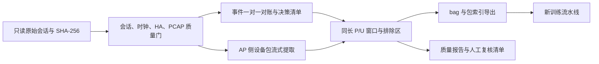

# LX04 会话的 P/U 训练数据构造设计

状态：2026-09-24 设计与首批数据处理。对象是 2026-09-23 的 `speaker_formal_retries_20260923` 会话。本文所说的“包”是多实例学习中的**流量窗口 bag**；窗口内的单个网络数据包是 instance。给窗口赋正标签，不意味着窗口内每个网络包都已被证明由该操作引起。

## 1. 目标与已知证据

目标是把一次连续抓包、厂商 App 操作日志和 HA 被动状态日志转成可追溯的 `Positive`/`Unlabeled` 流量窗口，减少依赖人工逐条核对方向、长度和协议的工作，同时保持与 `iot-event-recognition` 新训练流水线的输入契约兼容。

本会话的原始资料位于 `automation/runs/sessions/speaker_formal_retries_20260923/`：`traffic.pcapng`、`actions.jsonl`、`ha_history.json`、`ha_clock_probe.json`、`clock_sync.json`、`session.yaml`。`pcap_review.json` 和 `ha_reconciliation.json` 是已有派生证据，必须核对原始资料与哈希，不应直接把报告里的布尔值当成不可复查的标签。会话配置记录了 AP 接口 `wlp2s0`、热点侧设备 IP `10.42.0.196`、抓包过滤器 `host 10.42.0.196`。抓包报告统计设备发出 6,243 个 IP 包、收到 7,450 个 IP 包，45 个操作窗口都有双向包；完整 PCAPNG 另含 28 个 ARP 帧，共 13,721 帧。动作日志有 45 次尝试，其中 40 次有 App 回执，5 次超时；HA 对账给出 40 个候选正事件。它们在已有报告中的 `manual_review` 仍为 `pending`。用户于 2026-09-24 在本任务中确认昨日数据有效，并说明截图因 GitHub 插件阻断而没有上传。派生清单须记录该确认，且不能改写原始对账报告的状态。

这些数字说明该会话有足够的自动对齐线索，并**不**证明窗口内的每个网络包都是播放或暂停指令：音乐流、心跳、DNS 和重传可能同时出现。还有一项严格金标准缺口：`ha_clock_probe.json` 只有会话结束后约 09:46:11 UTC 的一次时差测量；`clock_sync.json` 是抓包主机本机时钟记录，不能代替会话开始时的 HA 双机测量。旧[实验设计 §8.1](厂商App异网自动化实验设计.md#81-时钟要求)要求会话开始与结束都记录偏移。因此 −27.718±1.228 ms 只能说明测量瞬时的时差，不能严格界定此前约 10 分钟内的漂移。用户确认可支持本批**试验性 Positive** 准入，但不能把它称为已满足全部严格 `P_gold` 门槛。当前只有一个正式会话，不能用它给出跨会话泛化指标，也不能把此会话内随机拆出的测试窗口称为独立测试集。

## 2. 观测点与设备 IP 决策

旧镜像口抓包时，路由器与设备之间的通信不可见；旧流程围绕云服务器 IP、固定包长、方向和协议寻找精确序列。现在 IoT 设备通过抓包主机的 Wi-Fi 热点上网，`wlp2s0` 是设备侧、NAT 前的 AP 接口。原[实验设计 §3.2](厂商App异网自动化实验设计.md#32-场地受限时抓包主机兼作实验热点)明确要求记录热点侧设备 IP/MAC、在 AP 口先做无过滤器短抓包核对双向覆盖，并指出仅抓外网上行接口会因 NAT 丢失设备身份。因此，本批数据以**会话记录的设备 IP 与抓包接口**为设备流量归属依据：方向定义为相对设备的出站/入站，不再把云服务器 IP 当作唯一入口或方向参照。

设备 IP 是数据提取条件和溯源字段，不应直接作为模型特征。云端 IP、端口、DNS 名、TLS/TCP/UDP 类型、长度和包方向可用于诊断、分层统计、候选排序，但不能设成正包准入的固定签名，否则会再次只找到少数严格匹配序列，也会把云端迁移、长连接复用、设备到网关的本地通信漏掉。热点与旧镜像拓扑须用 `capture_topology` 分开记录、分别校准延迟和评估；不可默认合并成同分布数据。

本次原始抓包在采集时已应用 `host 10.42.0.196`，所以后处理**无法恢复**被该 BPF 排除的帧；虽已捕获 28 个 ARP 帧，也不能由此推断所有 ARP、广播或发现流量均被完整记录。设计中的“不过早删 DNS/控制包”只针对已经捕获的流量。下一次试采集应先无过滤器检查 AP 口实际可见范围，再决定正式过滤器。IPv6、设备换 IP、热点重连、NAT 观测点变化均需独立记录和处理。

## 3. 标签语义与准入规则

### 3.1 三个层次

| 层次 | 含义 | 训练用途 |
| --- | --- | --- |
| `P_candidate` | 自动对账提示可能是目标事件；已有 `candidate_gold=true` 属于这一层 | 等待完整质量门核查 |
| `Positive` | 操作、App 状态、HA 独立状态和流量覆盖通过；本批有用户有效性确认，但只有单次会后时钟测量；正标签作用于整个 bag | 本会话的**试验性** P/U 训练输入，保留 `strict_gold=false` |
| `Unlabeled` | 设备流量窗口的事件身份未知；可能含遗漏的目标事件 | PU 输入中的 U，绝不是已证实负类 |

`P_candidate` 不自动等于 `Positive`。已有 `pcap_review` 的“窗口有双向包”也不是事件因果证明。对本会话，用户的有效性确认与源文件质量门共同完成**试验性**候选晋级；把确认与单点时钟例外作为派生元数据保存，保留 `manual_review=pending` 原文。未来未经同等确认的会话，仍需人工复核或另设明确、可重复的自动确认政策。最终论文用的严格金标准还需开始/结束双时钟测量、审核记录与独立会话验证。

### 3.2 正包门槛

逐事件同时检查：

1. 事件属于目标设备和目标事件类型，`event_id` 唯一；操作类型、`state_before`、`expected_state`、`state_after` 与定义的播放/暂停状态转换一致。`result` 为已回执状态；超时或失败不能因“附近有包”变为正例。
2. HA 历史来自指定实体，先把 HA 时间加上实测的 `capture_minus_ha_ms` 映射到抓包主机时间轴；同一操作只能唯一匹配一次预期状态转换，上一状态和操作前状态一致，匹配时间位于预设延迟容忍范围内。时差与测量不确定度在已定义上限内。本会话仅有会后一次时钟测量，故只按用户确认的试验性例外准入，必须记录 `clock_evidence=single_post_session_probe`，不得声称已验证整段会话漂移上界。
3. PCAP 哈希与报告一致，覆盖所选窗口；设备 IP 的双向包在窗口附近可见。必要时核对实际包时间范围和抓包丢包/截断信息。单纯文件存在或“有双向包”不够。
4. 构造的正窗口内没有另一次操作、失败重试或未知状态转换。时间窗若交叠，不把两次动作都当作独立纯正例；先尝试按统一窗口规则重新定位，仍冲突就移入待复核。
5. 所有排除原因写入 `event_decisions`；代码不静默丢弃记录。用户确认被记录在派生清单，不回填原始 `actions.jsonl` 或 `ha_reconciliation.json`。

对一次事件确认的是“该窗口包含目标事件”。即使窗口包含背景流量，也不逐实例写正标签。这与原[实验设计 §9.1](厂商App异网自动化实验设计.md#91-金标准正包-p_gold)的 MIL 语义一致。

### 3.3 未标注与待复核

在连续设备流量上用与正包**同样时长**的窗口生成 U，保留两个来源层：`uncertain_action` 是未通过正包门槛但仍能从原始抓包完整取出的操作窗，`background` 是所有操作保护区之外的安全背景窗。超时和重试不能仅因附近有流量晋级为 Positive，但只要它们的固定窗不与已确认正窗口或另一操作窗冲突，便按用户要求标为 Unlabeled，并保留失败原因；若时间覆盖不足、包为空或有窗口冲突，则记录排除原因，不能虚构实例。背景采样仍排除全部操作尝试的不确定时间范围、抓包开头和末尾不完整窗口。U 可能含实际目标事件，不能按负类解释；训练或审核时应保留 `uncertain_action`/`background` 来源层，防止隐含的来源捷径。窗口之间若有原始包重复，记录并限制复用；跨数据分区不允许重复原始包。

## 4. 时间对齐和窗口

1. 内部统一使用 UTC Unix 纳秒；显示时区只用于人阅读。点击真实发生在 `[t_cmd_before_ns, t_cmd_after_ns]`，不能用点击结束或 HA 更新时间冒充精确点击时刻。
2. `t_ha_capture_ns = t_ha_utc_ns + round(capture_minus_ha_ms × 10^6)`。本会话时差为 −27.718 ms，测量不确定度最多 1.228 ms；把这两项写入每个事件的审计字段。
3. 先制作事件延迟表：点击开始至 App 回执、校正后 HA 状态、候选流量突发的分位数，以及相邻操作间距。按事件类型在**试采集或训练会话**上选取窗口长度、前置量、后置量、保护区和 U 滑动步长；配置冻结后才用于验证或测试会话。此会话可用于首版试采集参数，但不能再把它当作独立测试。
4. 这批数据中 40 个候选事件的“点击开始 → 已校正 HA 状态”延迟为 1.445–2.969 秒，中位数 2.063 秒、P95 为 2.689 秒；相邻点击开始至少相隔 10.246 秒。因此首版可选固定的 **4 秒**窗口 `[t_cmd_before_ns, t_cmd_before_ns + 4s)`，它覆盖全部 40 个 HA 转换，并在最慢事件后仍留约 1 秒。这个数值来自本次试采集，不能不经重新校准直接用于另一设备、拓扑或正式测试。
5. P 和 U 使用同一个固定窗口生成器。P 的锚点由点击区间与状态证据决定，固定窗口需覆盖主要响应并避开下一操作；若无法同时满足，两次动作进入待复核。未通过 P 门槛的完整、非交叠操作窗单独标为 `uncertain_action` U。另一类 U 在允许的连续时间段上以 **4 秒步长**从每个安全区间左端铺设完整 4 秒窗，且距任意操作/正窗口至少有 1 秒保护区；超时尝试的完整不确定时段仍要从**背景采样**中排除，避免重复取窗。不要让 P 使用短窗口而 U 使用整段事件间隙。
6. 生成窗口边界表后，再一次流式遍历 PCAP，把设备包分配到窗口；以原始包序号与纳秒时间作为稳定索引。窗口为左闭右开，避免边界包重复。保留所有已捕获的 IP 包，且把 DNS、TCP 控制包、重传等以特征或审计字段呈现；可附加一种“仅应用数据包”的消融视图，但不改写原始包集合。

窗口参数不能凭旧脚本中一个 `timeout_ms=5000` 来设定。旧脚本对每个候选包要求方向、帧长、协议逐项完全相等，还将匹配序列首尾间的原始包切出；这一做法会让背景包混入导出片段，并大幅压低召回。新流程把**已确认动作与 HA 状态**作为标签证据，把包长/方向/协议转为可学习特征和质量诊断。

4 秒窗在本次 40 个候选中共含 1,951 个设备 IPv4 包、6 个 ARP 帧，单窗 IPv4 包为 20–91 个，中位数 40.5 个。1,957 帧里有 52 帧 DNS、68 帧发往固定组播地址、1,343 帧零载荷 TCP，其中 926 帧为纯 ACK；因此“先删 DNS 和 TCP 控制包”会不可逆地改动约 70% 的候选窗内容，必须作为可复查的特征视图选择，而不能当作真值筛选。另有 1,078 帧的对端地址位于 `198.18.*`，固定云服务器 IP 白名单会漏掉大量现有流量，但仅凭地址本身不能断言其真实服务角色。一个明显的长窗污染例子是第 35 次操作：旧式“前 2 秒至回执后 5 秒”窗共 2,116 包，而其点击后 4 秒窗只有 54 包；第 4 秒后又出现约 1,975 包的大流量。这说明缩窗能降低连续媒体流混入，但不能据此把保留的 54 个包逐一称为事件包。按“成功尝试保护到 `max(P终点,App回执,校正HA)`、失败保护到下一次点击、两侧扩 1 秒、额外 HA 变化也保护、各安全区左端每 4 秒铺窗”，目前得到 **46 个**非空背景 U；失败操作窗另作为 `uncertain_action` U 层统计，不与背景采样混计。背景 U 单窗设备 IPv4 包数 2–1,533，中位数 44。U 的大流量长尾与 P 的 20–91 包形成明显分布差异；应在质量报告中显示分层分布，并在训练时检查简单包数基线，不能把样本数量接近视为分布已匹配。

## 5. 处理步骤与实现边界



处理应做成确定性、可重复运行的离线命令：输入会话路径、输出目录、固定窗口配置、事件字典和确认记录；输出只写新的 `derived/` 目录。相同输入哈希与配置应产生相同 bag ID 和包索引。读取 PCAP 应流式处理，避免把长会话全部载入内存。解析失败、哈希不匹配、时间覆盖不足、设备 IP 与会话不符必须显式失败。源文件只读，绝不覆盖 PR 中的证据。

Windows 检出后，`actions.jsonl` 与 `ha_history.json` 的本地原始字节哈希可能因 Git 把 LF 行尾改为 CRLF 而不同于 Linux 生成的报告哈希。本批可额外计算**只做 CRLF→LF 字节变换**后的哈希来验证报告，分别记录 `checkout_raw_sha256`、`normalized_lf_sha256` 和报告给出的 SHA；不通过解析 JSON 再序列化来伪造一致。二进制 `traffic.pcapng` 必须以原始字节精确匹配报告 SHA。`session.yaml` 虽无既有报告哈希，也须记录当前检出文件的原始 SHA，以锁定设备 IP、接口和过滤器依据。

### 5.1 可重复的窗口决策

给定固定窗口 `W=4s`、保护区 `G=1s` 和事件字典，按以下顺序计算，保证标签决策不会受文件遍历顺序或人工筛包顺序影响：

```text
读取并校验源文件 → 解析45次动作 → 校正HA时间 → 一对一匹配状态变化
对每次动作：
    若通过正包门槛，P = [t_cmd_before, t_cmd_before + W)
    否则，若固定窗完整、有设备包且不与 P/其他操作窗冲突，输出带原因的 uncertain_action U
    无论成功或失败，建立操作不确定区间；失败至少覆盖点击开始、回执等待/超时与重试
成功尝试保护到 max(P终点,点击返回,App回执,校正后HA状态变化)；失败尝试保护到下一次点击或明确恢复点
合并所有 P、操作不确定区间、额外 HA 状态变化的保护区，并向两侧扩 G
安全背景 = [PCAP首包时间, PCAP末包时间) - 上述区间并集
每个安全区从左端起以步长 W 铺设长度 W 的整窗作为 background U；不足 W 或无设备包的窗口记录原因
一次流式读取 PCAPNG，把设备 IPv4 包按原始 1-based packet_index 分配给 P/U 窗
核对每个实例时间在所属窗口内、每个任务视图内 P 与 U 无原始包重用，并导出三个任务视图
```

如果额外 HA 状态变化没有对应 App 操作，它首先是需要调查的未观测事件，邻近窗口不能被视为安全背景。对固定音乐流或周期心跳，不用精确包长模板直接删包；可输出每窗纯 ACK 占比、DNS 占比、最大突发速率和与静态背景的差异，供批量审核优先级排序。该排序不自行改写 `Positive`/`Unlabeled` 标签。

### 5.2 源数据门与停止条件

| 检查 | 成功条件 | 失败处理 |
| --- | --- | --- |
| 文件身份 | `pcap_review.pcap_sha256` 等于实际 PCAP 哈希；会话、设备、实体 ID 与动作一致 | 停止导出并报告不一致的文件 |
| 时间 | 捕获起止覆盖全部选中窗口，HA 时差及不确定度满足会话规则；严格金标准还需会话开始/结束双测量 | 本会话单点测量仅作明示的试验性例外，`strict_gold=false`；无任何可靠测量则停止准入 |
| 状态 | App 前后状态为合法转换；HA 唯一匹配且前态相同 | 该次尝试不生成正包；完整、非交叠的操作窗标 `uncertain_action` U，邻近时间从背景 U 采样排除 |
| 事件干扰 | 正窗口不含另一操作开始、未知 HA 变化或另一正窗口 | 标记 `overlap`，保留事件供人工判断 |
| 包索引 | 每个 instance 的 1-based 序号能在同一 PCAPNG 回查到同一时间与设备方向 | 停止导出；不得“自动修复”索引 |
| 训练视图 | 三个任务的 P/U 都非空，bag ID 唯一、实例非空、枚举完全符合新仓库 | 分任务报告不可训练原因，不伪造背景 U |

会话的 `capture_ok` 目前主要证明抓包文件存在并非空，尚不是严格的抓包丢包或双向覆盖保证；派生质量报告要补上实际 PCAP 时间范围、逐事件包数及可用的丢包信息。若没有丢包统计，写 `unknown`，不能填 0。

阶段性输出建议：

| 文件 | 关键字段或作用 |
| --- | --- |
| `source_manifest.json` | 输入相对路径、SHA-256、会话/设备/拓扑、捕获接口和过滤器、参数版本、用户确认的文字与日期 |
| `event_decisions.jsonl` | 每次尝试的原始状态、HA 匹配、时差、窗口、准入级别、排除原因和复核状态 |
| `bags_manifest.csv` | 稳定 bag ID、`Positive`/`Unlabeled`、事件类型、会话、起止纳秒、包数、来源包序号范围和质量标记 |
| `packet_index.csv` | 原始帧序号、时间、设备方向、L3/L4 协议、长度、载荷长度、会话与 bag ID；网络地址保留在审计列，不直接喂模型 |
| `quality_report.json` | 40/45 事件去向、P/U 数量、空包/截断/交叠、时钟/抓包覆盖、两类窗口时长与实例数分布 |
| 训练适配文件 | 按新训练仓库所需的 bag JSON、PCAP 路径及字段导出，明确 `Positive`/`Unlabeled` 枚举 |

按用户选择，首批同时导出三个目标视图：`play_music`、`pause_music` 各自的 P/U 视图，以及 `any_playback_change`（任一播放状态变化）的合并 P/U 视图。三者共享同一个原始 PCAPNG、包序号和来源清单，但 bag ID 带任务名，防止混用。播放事件在“暂停识别”任务里不是已标注负类；首版 U 只取操作保护区之外的背景窗口，不用另一目标事件充当负例。合并视图只能评价是否发生状态变化，不能拿来声称能区分播放与暂停。

## 6. 与新训练方法衔接

`iot-event-recognition` 的现有链路从 bag JSON 合并、PCAPNG 提取逐包特征、归一化、自动编码器嵌入走到 bag 模型。本次在 `derived/training_views/<task>/` 分别导出 `bags.json`、`unlabeled_bags.json` 和两者拼接的 `valid_bags.json`，同时保留更完整的来源清单。每个 JSON 文件顶层为 bag 对象列表。正包至少含 `bag_id`、`event_type`、`bag_label: "Positive"`、`instances`；U 至少含相同关键字段及 `bag_label: "Unlabeled"`。每个 instance 至少含 `instance_id`、`packet_index` 整数和 ISO-8601 `packet_time`。`stratum` 区分 `positive_action`、`uncertain_action` 与 `background`，不作为模型特征。训练脚本把 `Positive` 映射为 1，把 `Unlabeled` 映射为 0；该 0 只是实现中的 U 编码，**不能**在报告里称为真实负类，也不能把基于此的普通二分类结果冒充严格 PU 风险。

该仓库现有特征提取用 `PcapNgReader` 并按**从 1 开始**的全文件包序号回查 `packet_index`，因此导出必须同时给出与索引一致的 `.pcapng` 路径，不能只生成时间窗口 JSON。首版直接复用 `traffic.pcapng`，所有索引指向原始帧序号，包括非设备帧占据的序号；不得先删 DNS/ARP/控制包后仍沿用旧索引。以后若另建过滤后 PCAPNG，必须重新从 1 编号并保存“派生序号 → 原始帧序号”映射。两种方式只能选一种并在 manifest 中锁定。下游标准化器仅在训练会话上拟合；现有单会话不适合评估，需等新独立会话再划分训练/验证/测试。

训练仓库原有的 `src/config/datasets.py` 仅注册 `light` 和 `camera_light` 两个数据集。本次增加可选的 `IOT_EVENT_DATASET_MANIFEST` 入口：设为 `derived/training_manifest.json` 的绝对路径后，按该清单所在目录解析三种视图的 bag、PCAPNG 和输出目录，注册 `lx04_play_music_speaker_formal_retries_20260923`、`lx04_pause_music_speaker_formal_retries_20260923` 与 `lx04_any_playback_change_speaker_formal_retries_20260923`。原有数据集不受环境变量未设置时的影响。三种视图都指向**同一个**原始 `traffic.pcapng`，但各自有独立的特征、嵌入和模型输出目录；不能用覆盖旧 `light` 路径的方式接入。适配改动同时保存在 [可移植补丁](iot-event-recognition-external-dataset.patch)，便于在训练仓库的原始检出版本复现。`split_dataset.py` 及训练脚本需要 `splits.json` 中的 train/validation/test bag ID；本批只有一个会话，不应随机拆它来伪造独立验证/测试。后续加入不同会话后再按 `session_id` 生成该文件。

另一个已修复的下游阻塞项是 `packet_features.py` 的方向计算。原实现只在“设备 IP ↔ 唯一服务器 IP”恰好匹配时给 `+1/-1`；`device_ip` 已配置而 `server_ip=None` 时仍会尝试自动推断。LX04 抓包有设备、网关和多个外部端点，自动推断会抛出异常。新增的“仅配置设备 IP”分支按设备中心定义：源地址等于 `target_device_ip` 为 `+1`，目标地址等于该 IP 为 `-1`，其余为 `0`；已有设备 IP 时跳过端点自动推断。旧单服务器数据集仍走原有双端点分支；已用定向回归核对其输出。不能给 LX04 随意挑选一个 `server_ip` 使脚本“能跑”，那会悄悄把大部分包方向置零。

在训练仓库的 Python 环境装有其原有 Scapy 依赖后，可在 PowerShell 中先设置 `$env:IOT_EVENT_DATASET_MANIFEST` 为上述清单的绝对路径，再运行 `python src/dataset/prepare_dataset.py --dataset lx04_play_music_speaker_formal_retries_20260923` 和 `python src/feature_extraction/packet_features.py --dataset lx04_play_music_speaker_formal_retries_20260923`；另两个视图只需替换 dataset 名称。现有导出已经带 `valid_bags.json`，`prepare_dataset.py` 可用于重新校验和生成摘要。该步骤仅证明输入契约，不应继续在同一会话随机拆分后报告测试性能。本机缺少 Scapy 且配置的包镜像站不可访问，因此特征提取的完整运行还需在训练环境复验。

现有 `split_dataset.py` 主要按共享包实例约束划分 bag；不同窗口即使没有共享包，仍可能来自同一次连续会话。新数据必须以 `session_id` 为不可拆分分组，再检查包实例不会跨分区；否则同一段音乐会话的邻近窗口可能同时进训练和测试。单会话时仅可导出未来训练池与接口样例，不生成貌似独立的验证、测试成绩。

## 7. 质量验收与效率判断

首批数据处理完成后，至少逐项给出：

- 每条 45 次动作的唯一决策，40 个候选分别有何去向；失败/重试保护区是否覆盖完整。不能只报“输出多少正包”。
- 原始 PCAP、HA 历史、动作日志哈希；设备包总数与双向覆盖；每个 P 的点击、HA 与 PCAP 时间关系；P/U 窗口是否重叠、为空或出界。
- P/U 的时长一致性、实例数分布、上下行数量、可选包长方向序列；按事件类型和会话汇总。窗口长度或实例数若足以简单区分 P/U，应调整抽样或模型输入。
- 旧严格序列规则在同一会话识别到的事件数、新方案准入数，以及抽样复核的误准入数；效率提升用“每人工复核小时得到的合格正窗口数”描述，而不是只看模型训练指标。
- 训练适配器的 bag ID、标签、packet_index 与 PCAP 实包逐一核对；准备数据可被 `prepare_dataset` 和特征提取读入。

### 7.1 本次构造与验收结果

这次派生文件写入 `automation/runs/sessions/speaker_formal_retries_20260923/derived/`。该运行目录被 Git 忽略，便于阅读的 [训练清单与质量报告快照](lx04-pu-output/README.md)另放在文档目录；训练时仍使用原件。45 次点击有 40 次通过动作、App、HA、时钟与抓包门槛，形成试验性 Positive；5 次超时保持非正例，但其点击后 4 秒窗均完整、有目标设备 IPv4 包且未与其他动作或正窗冲突，形成 `uncertain_action` Unlabeled。另有 46 个操作保护区外的 `background` Unlabeled。原始对账文件的 `manual_review=pending` 没有被改写。

| 训练视图 | Positive 窗 | Positive 实例 | Unlabeled 窗 | Unlabeled 实例 |
| --- | ---: | ---: | ---: | ---: |
| `play_music` | 20 | 867 | 51 | 4,407 |
| `pause_music` | 20 | 1,084 | 51 | 4,407 |
| `any_playback_change` | 40 | 1,951 | 51 | 4,407 |

每视图的 51 个 U 中，46 个 `background` 含 4,185 个包，5 个 `uncertain_action` 含 222 个包；两层均保持 4 秒窗。完整 PCAPNG 有 13,721 个包记录，全局 1-based 索引连续。除导出器自身检查外，又按 PCAPNG 原始块结构独立遍历了全部 13,721 条包记录，核对 13,693 个 IPv4 帧的地址、全部帧的时间戳与长度，确认索引表和原始文件一致。逐实例核对导出时间落在窗口内、其 `packet_index` 对应 `packet_index.csv` 中同一设备 IPv4 记录；每个视图内没有原始包复用，P 与 U 没有交叠。源 PCAPNG 的原始字节 SHA-256 与 PR 报告一致；文本报告哈希仅按 Windows 检出所需的 CRLF→LF 字节归一化核验。`source_manifest.json` 还记录了 `session.yaml` 当前检出哈希。

三个视图已通过训练仓库的 `DATASETS` 动态注册和 `prepare_dataset.py` 校验，后者重组出的 `valid_bags` 与导出内容在 JSON 语义上相同。新旧包方向分支的定向回归核对通过。离线构造器定向测试 8 项通过（含 1 MiB 读取边界处的 CRLF 哈希校验），Ruff 与 `git diff --check` 通过。完整自动化测试集在本机因缺少 Pillow 无法收集；逐包特征提取因缺少 Scapy 且配置的依赖镜像不可访问，尚未在本机完整运行。这两项应在装有原训练依赖的环境复验。旧固定序列脚本没有在同一会话重新运行，因此此处不虚报一个“旧方案正包数”或精确人工效率增益；可确定的改进是 40 个已对齐候选不再逐包套固定方向、长度和协议签名。

正式报告还需要多会话、按 `session_id` 划分，及未参与参数选择的独立审计集。本会话最多可完成首版数据构造与接口验证，不能支持可靠 F1、误报率或跨拓扑结论。

## 8. 待讨论与后续会话建议

1. **确认记录的形式。** 本次用户已确认数据有效，派生清单可据此准入，但建议补充可版本化的 `review_decisions.json`，记录确认范围（整会话或逐事件）、复核人、时间、证据路径和例外项。截图未随 PR 上传时，至少保存其本地哈希或脱敏的人工复核摘要。
2. **下一批抓包过滤器。** `host <设备 IP>`适合当前 IP 层事件任务，但会漏非 IP 帧。若需研究设备发现、ARP、本地广播，应先无过滤器试抓，验证是否可见，再确定采集范围。不要对这批已有 PCAP 声称拥有未捕获数据。
3. **窗口长度的冻结。** 从本会话统计延迟与相邻操作间隔，记录参数选择依据。正式验证须另采会话，不能边看测试结果边调窗口。若播放/暂停的最佳延迟不同，可按事件类型配置，但同一目标事件内 P/U 必须同长。
4. **训练算法语义。** 当前新仓库的 bag 模型把 U 编码为 0；若研究目标是严格 PU-MIL，应另实现 PU 风险/先验估计，并以当前模型作为基线。标签构造层始终保留 U 语义。

## 9. 依据

- [最新 PR #3：小爱触屏音箱播放/暂停实验与对齐数据](https://github.com/ly-0110/HA/pull/3)
- [热点拓扑与抓包范围](厂商App异网自动化实验设计.md#32-场地受限时抓包主机兼作实验热点)
- [时间窗与 P/U 标签要求](厂商App异网自动化实验设计.md#8-时间同步与事件对齐)
- [现有数据与评估整改意见](项目当前问题与整改意见.md)
- [`automation` 的 LX04 会话说明](../automation/README.md#101-小爱触屏音箱-lx04音乐播放与暂停)
- 旧版固定序列处理脚本已迁移至独立数据处理仓库。
