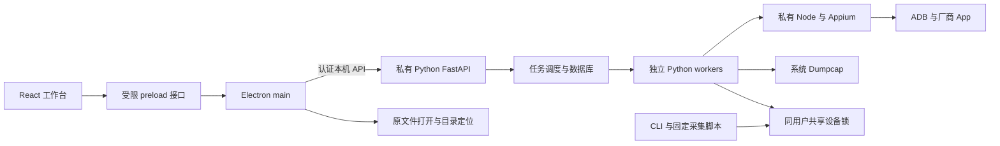

# Design

## Context

动机和能力范围见 [proposal.md](proposal.md)。本方案以当前工作区已经完成的工作台改进为起点。2026-10-04已有内部测试制品及Windows无抓包真机闭环；Windows交付文件位于automation/desktop/releases/windows-0.1.3；原生Ubuntu剩余条件见tasks.md。

当前 React/Vite 工作台通过 FastAPI 操作 SQLite 任务库，scheduler 以 `sys.executable -m iot_exp.worker` 启动独立 worker。CLI 与采集脚本复用实验模型、适配器和编排器。桌面改造必须解决下列源码目录假设：

- `web.py`、`cli.py`、`worker.py` 通过 `__file__.parents[2]` 定位 automation 根；配置、静态资源、数据库和输出根混用。
- Appium 包位于当前根 `node_modules`，`npx` 配置最终仍可能转为普通 `node` 命令；系统检查从 PATH 找 Node/Java。
- 资源锁跟随 `runtime.output_root`，不同输出目录的进程并未天然处于同一锁空间。
- 浏览器 bootstrap 返回控制令牌，仅变更请求检查令牌；桌面模式需要覆盖数据读取端点的认证。
- 现有退出流程只请求取消，没有完整等待 worker/抓包/Appium 清理；重启时任务状态恢复也不能只依据数据库旧状态。

现有两份事件规格继续适用。厂商 App 触发、HA 被动、`app_ack_only` 证据等级、网络隔离与正式预检不因桌面分发改变。

## Goals / Non-Goals

**Goals:**

- 普通实验者安装后可在没有全局 uv/Python/Node/npm、没有网络的情况下打开工作台、查看记录和完成模拟实验。
- 真机及正式采集通过可解释的分层准备和预检接入；依赖缺失只阻止相应能力。
- 核心逻辑保持 Python 单一实现，React 保留现有事件编辑和一键启动体验；桌面壳不复制实验判断规则。
- 明确安装资源、用户状态、实验输出、CLI 互斥、退出与恢复的契约，使应用可搬迁并可可靠导入现有工作区。

**Non-Goals:**

- 首版不支持 macOS、ARM、WSL 或无图形 Linux；Windows 10、Ubuntu 22.04 为后续独立兼容验证对象。
- 不开发统一多手机单编排器，不新增设备适配器，不自动登录/授权手机，不改写历史实验数据。
- 不让 Electron 以管理员/root 运行，不自动绕过 SDK、驱动或系统权限确认。
- 首版不做静默自动更新，不在实验进行时更新运行时，也不因崩溃自动重跑实验。
- 根据2026-10-06用户范围调整，不开展安装升级/卸载深度演练、干净系统断网专项验收、规模化分发签名/长期维护、升级回退或多入口并行完整演练。保留已有防护实现、核心自包含运行、共享锁和进程所有权要求；不删除历史验证，不以取消验收推定通过。
- 同日用户进一步取消操作系统强制关机、注销或断电专项验收。正常退出、各层进程崩溃、至少60秒后显式强制终止及部分产物保护继续验收；没有把操作系统关机记录为已验证。
- 2026-10-07按有限实验用途保留基础资产来源/版本/声明/通知与边界审查，将全面对外分发条件证明、逐库源码缓存与重链接专项移出本轮验收。SDK采用已验证固定清单，不穷尽最小集合；资源与数据分离、不写安装资源的契约保留，以正常安装运行及散列核对为依据，不追加Windows ACL专项试验。具体材料未核对事实保留，对外交付方式改变时另行核对适用条件。

## Decisions

### 1. Electron 承载界面，Python 保留核心

Electron main 负责窗口、单实例、依赖解析、后台监督和桌面文件能力；Python 负责配置校验、预检、调度、实验与证据。采用 `child_process.spawn`，固定可执行文件与参数数组启动 Python，禁止 shell 拼接命令。`utilityProcess.fork` 面向 Node 模块，不作为 Python 启动器。[Electron utilityProcess](https://www.electronjs.org/docs/latest/api/utility-process)

新建 `automation/desktop/`，隔离 main/preload 和桌面构建依赖；复用 `automation/web/src/`。采用 Electron Forge 制作 Windows 用户级安装包和 Ubuntu `.deb`，在各平台原生构建。浏览器入口继续可用；前端访问层通过 desktop/browser 两种实现复用组件。选择这一结构，是因为重写 Python 为 JavaScript 会扩大已验证实验逻辑的回归面，单纯包一层窗口则不能解决运行环境与生命周期。

### 2. 私有真实解释器和独立 Node

首版分发可搬迁 CPython 3.13 解释器和构建阶段预装的 `iot_exp` wheel/依赖。以 `python-build-standalone` 的固定发行资产为统一候选来源，按目标 OS/架构生成清单并验证许可与运行兼容性；不复制开发机 `.venv`，不使用 editable install。Windows DLL、Linux 动态库与 Python wheel 都在目标平台验收。

worker 保留模块启动方式，但解释器来自显式运行上下文。暂不使用 PyInstaller：冻结后 `sys.executable` 是 bootloader，现有 `-m iot_exp.worker` 不能照搬；未来改用冻结后台须另行设计 server/worker/cli 子命令。[PyInstaller 运行时说明](https://pyinstaller.org/en/stable/runtime-information.html)、[Python Build Standalone](https://github.com/astral-sh/python-build-standalone)

Appium 使用私有 Node 24 LTS、独立 Appium runtime package 和 Temurin JDK 17 LTS。当前 `package-lock.json` 锁定 Appium 3.7.0、UiAutomator2 6.9.3，作为首轮兼容验证起点；独立 runtime package 将两者声明为生产依赖，避免 `npm --omit=dev` 删除当前处于 devDependencies 的 Appium。具体补丁版本、依赖树和散列由构建步骤冻结，运行时不安装包、不执行 npx。Electron 的内置 Node 不被假定为可供 Python 调用的 `node.exe`；独立 Node 也允许关闭 Electron RunAsNode fuse。[Electron fuses](https://www.electronjs.org/docs/latest/tutorial/fuses)

完整依赖矩阵、SDK/驱动边界和锁定方法见 [runtime-dependencies.md](runtime-dependencies.md)。

### 3. 明确路径布局与工作区

定义由入口传入的运行上下文，不再从 Python 包目录或 cwd 推导业务路径：

| 路径 | 职责与默认布局 | 写入规则 |
|---|---|---|
| `resourcesRoot` | Electron `process.resourcesPath` 下的前端、内置模板、协议/运行时清单 | 只读；不得写数据库或实验结果 |
| `runtimeRoot` | `resourcesRoot/runtime/<os>-<arch>/` 的 Python、Node、JDK、Appium | 只读；外部可执行运行资产在 ASAR 之外 |
| `appStateRoot` | 显式设置 `userData = app.getPath('appData')/org.iotexp.workbench` | 小型偏好、工作区登记、日志和迁移记录 |
| `workspaceRoot` | 用户选择的实验工作区；建议本地 `~/IoTExperiments/default` | 配置、任务状态与数据目录；首次使用可改选 |
| `configRoot` | `workspaceRoot/config/experiment` 与 `config/runtime` | 用户副本/覆盖；内置模板按版本保留 |
| `workspaceStateRoot` | `workspaceRoot/state` | SQLite、取消标记、进程所有权记录 |
| `evidenceRoot` | 默认 `workspaceRoot/runs`；允许显式选择其他本地数据盘 | 保持 `sessions/<id>` 和 `campaigns/<id>` 产物格式 |
| `lockRoot` | Windows `%LOCALAPPDATA%/IoTExperimentWorkbench/locks`；Linux `${XDG_STATE_HOME:-~/.local/state}/iot-exp/locks` | 同 OS 用户共享，独立于工作区和输出目录 |
| `discoveryRoots` | 已登记的当前数据根、旧源码 runs/results、其他 CLI 输出目录 | 只读发现；相对路径/链接不能逃逸登记边界 |

大型 PCAP 不放在安装目录或 userData 中。外置盘断开、目录只读或磁盘不足时显示具体原因，启动相应实验前阻止写入。内置模板更新不覆盖用户修改；每次任务保存完整配置快照及模板/工具版本来源。

源码 CLI 默认目录与原参数继续有效；新增可选 workspace/lock 上下文，由共同路径解析器处理。打包 CLI 的入口使用同一私有解释器和同一核心模块，不要求系统 Python。

### 4. 桌面模式认证与接口

生产界面通过可信 `app://workbench` 资源加载，开启 `contextIsolation`、sandbox，关闭 `nodeIntegration`，使用明确 CSP。阻止任意导航和新窗口；官方帮助链接经固定 HTTPS 名单打开。main 检查 IPC 的发送窗口、主 frame、参数形状与长度。[Electron 安全指南](https://www.electronjs.org/docs/latest/tutorial/security)

在 ready 前将 app 协议注册为 standard/secure/supportFetchAPI，保持 bypassCSP=false；处理器绑定工作台专用 session。evidence 处理器同样校验请求发起来源、固定 host/路径和允许方法，不仅校验 IPC；只允许可信工作台访问认证代理。实验 HTML 拒绝显示为可信页面，XML/Markdown按惰性文本返回，文件流保留正确 MIME、nosniff 和 CSP，不因 app 协议获得额外权限。[Electron protocol](https://www.electronjs.org/docs/latest/api/protocol)

preload 仅暴露用途限定的 `request(operation, parameters)`、`openArtifact(sessionId, category, relativePath)`、`revealArtifact(...)`、工作区选择和桌面状态接口。operation 对应固定 API 方法/路径表；不接受任意 URL、可执行命令或绝对文件路径，不直接暴露 ipcRenderer。实验参数仍在 Python 严格校验。

主进程通过专用匿名管道传入 32 字节随机凭证、instance ID、主进程创建身份和路径上下文。凭证不进入 argv、URL、文件或日志。后台自行绑定 `127.0.0.1:0`，完成核心环境校验、数据库迁移与存活进程核对后，输出带协议版本、PID、端口和 instance ID 的单条 ready 消息；其余日志走 stderr。主进程在 30 秒就绪期限内完成带凭证健康请求，核对实例/协议，不把“端口能连接”当作服务可信。

桌面模式所有 API（含 GET 记录、日志、文件和预览）均认证；bootstrap 不公开凭证。认证健康检查成功前禁止提交任务。renderer 的 JSON 请求由 main 代理；图片/PDF 通过受限 `app://evidence` 流代理访问同一认证文件接口，防止直接文件 URL 绕过认证。文本仍使用最多 2 MiB 的受限预览。浏览器兼容入口使用明确 browser 模式，其现有令牌方案不得被桌面模式误继承。

### 5. 后台与任务生命周期

主进程在获取单实例锁前，显式设置稳定 userData 路径，不能认为 app ID 自动确定路径。该路径不随显示名、应用版本、安装路径或工作区变化；同一用户重复打开聚焦原窗口。一个桌面实例只激活一个工作区，其他工作区通过 CLI 或先完成当前任务再切换。不同工作区的硬件互斥仍由共享 lockRoot 保证。

后台状态为 `starting → ready → draining → stopped`，异常进入 `failed/recovery`。关闭窗口时若有本实例任务，提供“安全停止并退出”和“取消退出”；进入 draining 后拒绝新提交，停止派发并取消本实例排队任务，然后请求 worker 在动作边界停止。退出必须等待抓包结束、日志/质量报告落盘、Appium 会话与专属服务清理、所属锁释放，最后关闭后台。

清理超时持续显示进度；安全停止至少 60 秒后才显示显式强制终止选项。强制终止仅作用于已核实 PID 与创建身份的本实例进程树，原产物保持不完整状态。禁止无差别结束 Node/Appium、共享 ADB 服务或外部 CLI 任务。

| 故障 | 处理契约 |
|---|---|
| renderer 崩溃 | 后台与实验继续，重建界面读取现状，不重复提交 |
| Electron main 崩溃 | sidecar 通过父身份/管道 EOF 进入 draining；worker 的后台父身份监控作为第二层 |
| sidecar 崩溃 | 禁用新启动；worker 安全清理，核对存活进程与锁后才允许重启服务，不自动重跑实验 |
| PID 复用或旧 worker 存活 | 依据创建身份和 ownership 记录恢复；不能只因数据库旧状态或 PID 存在就重标/释放 |
| 异常进程结束或外部中断 | 重开核对身份与已有部分产物，保留 interrupted/待核查含义，不伪造 completed；操作系统强制关机/注销不属本轮验收 |

Windows关机/注销可能不走正常before-quit；2026-10-06用户明确取消该操作系统场景的专项演练。当前以正常退出与受控进程故障验证清理、所有权和诚实恢复，不从这些结果推定整机强制关机已经通过。[Electron app 生命周期](https://www.electronjs.org/docs/latest/api/app)

### 6. 跨入口共享互斥

新版 GUI、源码 CLI、打包 CLI 和活跃固定采集脚本共用上述同用户 lockRoot，锁键涵盖手机 UDID、稳定 IoT device ID、抓包接口身份、Appium 与 UiAutomator2 端口。模拟任务不获取硬件锁。

锁协议使用原子获取和带创建身份的所有权验证；只有当前所有者可释放。暂时为空、部分写入或不可解析的锁不得直接删除，过期回收须在并发协调下重新确认。出错时保守阻止派发并提供诊断。

旧输出目录锁作为兼容探测来源；登记旧工作区后，同时检查旧锁。已知仍在运行的旧版本任务必须等其结束，再切换共享锁协议。未升级、使用未登记输出目录的旧程序不具备新协议互斥保证；向导须明确提醒并提供升级/登记路径。多 OS 用户共同采集不在首版默认保护范围，必须另行配置公共 lockRoot 和权限后验收。

### 7. 原文件打开与证据边界

renderer 仅传会话 ID、类别和相对路径；Python 复用目录登记、文件扩展名和 resolve containment 校验，返回可信解析结果，main 在调用前再验证注册根。通过 `shell.openPath` 打开原文件或目录，通过 `showItemInFolder` 定位原文件；检查返回错误并显示默认应用/文件缺失问题。[Electron shell](https://www.electronjs.org/docs/latest/api/shell)

PCAP、截图、XML、JSON 和报告作为数据处理，不赋予 Node 能力。预览、打开和定位不修改原文件、生成下载副本或自动复制大文件；“导出/下载”作为用户明确动作。路径穿越、Windows ADS、越界 symlink、可执行脚本和任意外部 URI均拒绝。

### 8. 构建与本机安装

使用 Electron Forge，分别原生构建 Windows 11 x64 用户级安装包与 Ubuntu 24.04 x64 `.deb`；Deb 安装可以使用系统包管理权限，但应用/后台按普通用户启动。声明支持的平台与能力必须有相应制品和实际环境证据。应用面向有限实验者，签名和规模化发布不属于本轮交付验收。

制品包含前端、私有运行时、锁文件摘要、SBOM、SHA-256 和第三方许可文件。Python/Node/JDK/Appium 主程序在 ASAR 之外，只读供子进程执行。首版固定采用版本化可写 APPIUM_HOME：`appStateRoot/appium/<bundleId>/`，从已校验随包driver/APK/完整传递依赖模板初始化，重定位扩展索引；启动时只校验/重定位，不执行npm或driver install。不可变payload散列与可写索引的schema/版本/路径边界分别验证；不同时依赖npm项目自动发现。缓存和临时文件同样放可写状态目录。

SDK、抓包驱动和系统权限按依赖文档准备。已经取得许可的外部工具可以在管理员准备后离线复用；“应用离线启动”不表示厂商 App 的云端事件无需联网。

实验者使用本机制品安装。工作区迁移仍需一致备份与活动任务核对；实验数据独立于安装目录。已有Windows保护安装入口、Linux安装前钩子、版本匹配、签名配置及数据保留实现不移除，但不继续开展升级/卸载全入口、升级回退和签名专项演练，也不据此声明这些路径已验收。程序被外部替换/移除导致的中断仍遵守证据保留与诚实恢复契约。

## Risks / Trade-offs

- **安装体积上升** → 私有 Python/Node/JDK 增加体积，首版优先稳定；保留实际制品大小、散列和 SBOM，当前交付不建立长期发布维护流程。
- **第三方二进制分发与系统授权限制** → 默认不再分发 Google SDK/Npcap，使用官方准备路径，具体许可文件随清单审查，不承诺所有工具均可静默安装。
- **旧路径/锁协议与新工作区冲突** → 增加显式上下文、旧目录登记和升级向导，迁移期间阻止冲突任务；保留原 CLI 行为测试。
- **原生库、Appium driver 和旧 Android 不兼容** → 以本机私有运行时隔离、目标平台与目标手机实测核对；用户取消干净主机专项验收，不把现有系统模拟或打包成功推定为所有主机或设备可用。UiAutomator2 6.x 以 Android 8/API26 为最低工具约束。
- **异常退出残留采集进程** → 父身份链、进程所有权账本、保守恢复和无自动重跑；保留已有证据并诚实显示进程异常中断。整机强制关机未实测，按用户裁剪范围不再要求专项验收。
- **共享锁仅按用户隔离** → 明确首版边界，跨用户实验室部署需要公共锁配置与管理员验收。

## Migration Plan

1. 先完成路径/工具解析与共享锁改造，保持源码 CLI、浏览器和现有测试可运行；固定当前工作台成果作为回归基线。
2. 引入桌面后台模式和 main/preload，先以私有解释器完成无硬件模拟、认证与生命周期验收，再制作运行时制品。
3. 首次打开选择新工作区或登记旧 automation 根。迁移前检测活动任务，使用 SQLite backup API 获取含 WAL 的一致备份；事务迁移数据库并保存 schema/版本来源，不直接复制主数据库文件。
4. 用户配置导入为工作区副本；原 runs/results 登记为 discoveryRoots，不复制 PCAP、不改原始报告、不扫描 legacy。同名会话按根目录身份区分。
5. 迁移失败恢复备份并保留原目录；应用旧版本不得直接打开不兼容的新数据库 schema。回退可继续使用旧源码目录和独立备份，先确认无残留新实例任务和锁。
6. 完成 Windows 真机开发和 Ubuntu 正式采集的分开验收，再将桌面安装包作为主要入口；任何未完成平台/硬件验证在交付说明明确列出。当前Windows/WSL可验证工作独立推进，不把用户取消的分发与并行演练作为阻塞。

## 待实施时冻结的发行参数

技术选择和分发边界已确定。具体补丁版本、运行时资产 URL/散列、经 driver doctor 与真机验证的 SDK 包版本和实际制品大小由任务阶段冻结到清单；这些参数不能填成未经验证的“最新”或推定已兼容。现有签名配置保留供将来显式需要时使用，不要求本轮准备证书或签名验收。
